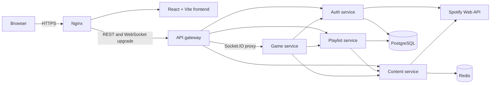
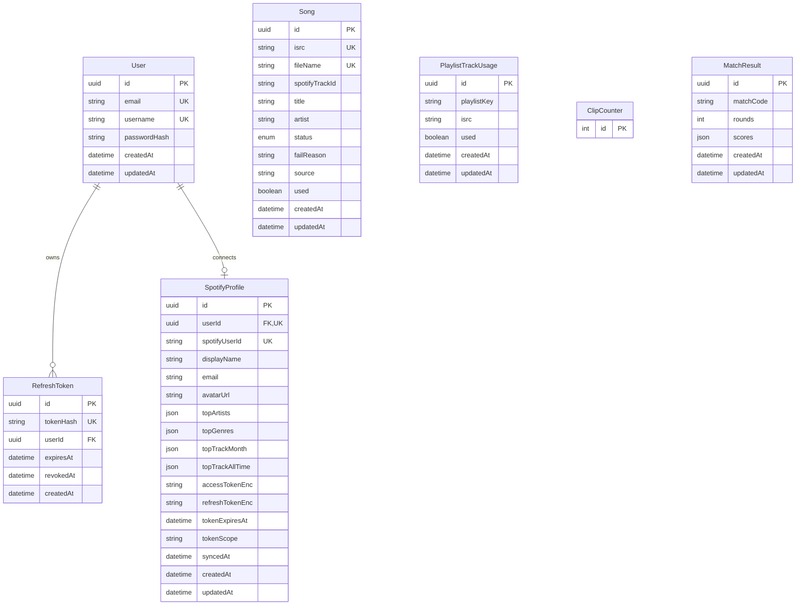

*This project has been created as part of the 42 curriculum by frmarian, smoore-a, jortiz-m, stitovsk, rjaada.*

# Songuess

Songuess is a real-time multiplayer music-trivia web application built around a
"Stop & Solve" mechanic. A shared 15-second track preview plays for everyone in
the room; the first player to lock stops the music for all participants and gets
10 seconds to identify the song. Correct answers earn points, while wrong or
expired guesses return control to the room.

The project replaces the traditional `ft_transcendence` Pong experience with a
complete browser game while retaining the subject's requirements for remote
multiplayer gameplay, authentication, persistent data, security, and a modular
web architecture.

## Key features

- Authenticated room creation and code-based joining for up to five players.
- Server-authoritative lobby, round, timer, lock, scoring, and rematch state.
- Synchronized audio playback and live updates through Socket.IO.
- First-to-buzz guessing with Spotify search suggestions and track validation.
- Shared typing feedback, skip/give-up voting, cooldowns, scoreboards, and song
  reveals.
- Local credentials authentication, rotating refresh tokens, and Spotify OAuth
  with encrypted Spotify tokens.
- Selection from a built-in mix, genre playlists, or a connected user's Spotify
  playlists.
- Background preparation of playable audio clips and reusable local media.
- Responsive React interface with reusable components and English, Spanish,
  Dutch, and Russian localization resources.
- Dockerized microservices behind an HTTPS Nginx entry point.

## Team information

Roles below reflect the team's working ownership and contribution history. All
five members contributed as developers in addition to their coordination or
specialist roles.

| Team member | Assigned role(s) | Responsibilities |
| --- | --- | --- |
| [Francisco Mariano Ortiz (`frmarian`)](https://github.com/pacomariano28) | Product Owner, Lead Frontend/Game Developer | Defined and refined the player experience; led match UI/UX, scoring and guess flows, playlist selection, rematches, navigation, and cross-service gameplay integration; coordinated product decisions and final interface direction. |
| [Seilán Moore Arnanz (`smoore-a`)](https://github.com/seilanmoore) | Tech Lead, Backend/Infrastructure Developer | Established the microservice architecture and development infrastructure; led the API gateway, authentication foundation, content and playlist services, WebSocket game engine, synchronization, Docker, Nginx/TLS, setup automation, and media preparation pipeline. |
| [Julia Ortiz (`jortiz-m`)](https://github.com/jortiz-m) | Authentication Developer | Worked on session termination and refresh-token revocation, including the logout route, cookie cleanup, gateway exposure, and authentication documentation on the authentication feature branch. |
| [Svetlana Titovskaia (`stitovsk`)](https://github.com/svetameanssun) | Project Coordinator, Frontend/Localization Developer | Led internationalization and translation integration; maintained locale resources, persistence migrations, profile/footer polish, and player controls such as leave-room and give-up behavior; helped reconcile integration changes across branches. |
| [Rachid Jaada (`rjaada`)](https://github.com/rjaada) | QA/Security Lead, Full-stack Developer | Performed security and concurrency reviews; fixed authentication exposure and token-lifetime issues, real-time listener stability, synchronization timing, leave navigation, and lobby readiness races; added regression tests and improved setup documentation. |

## Project management

- **Organization:** work is divided by feature and service ownership. Large
  changes are decomposed into focused branches and reviewed before integration.
- **Task distribution:** backend architecture and infrastructure were led by
  Seilán; product and gameplay UI by Francisco; localization and supporting UX
  by Svetlana; authentication flow by Julia; and security, reliability, testing,
  and targeted full-stack fixes by Rachid. Ownership overlaps where a feature
  crosses service boundaries.
- **Version-control workflow:** active development targets `develop`. Branches
  use `feature/`, `fix/`, `refactor/`, or `docs/` prefixes, and changes enter
  through pull requests. Commit titles follow
  [`docs/CommitFormat.md`](docs/CommitFormat.md).
- **Coordination:** the team uses Slack for asynchronous discussion, GitHub pull
  requests for durable technical review, and on-campus sessions for design,
  gameplay, and integration decisions.
- **Quality process:** contributors reproduce defects, inspect service logs,
  test changes locally in Docker, and keep unrelated changes out of focused PRs.

## Architecture



- **Nginx** terminates TLS and exposes one browser-facing origin.
- **API gateway** routes REST requests, applies rate limiting and request IDs,
  validates the access token for WebSocket upgrades, and proxies Socket.IO to
  the game service.
- **Auth service** owns users, credentials, sessions, Spotify OAuth, and token
  storage.
- **Content service** isolates Spotify catalogue access and caches application
  tokens in Redis.
- **Playlist service** owns the playable-song catalogue, playlist rotation, and
  background clip preparation.
- **Game service** is the authoritative in-memory state machine for rooms,
  rounds, synchronization, locks, guesses, scoring, disconnects, and rematches.
- **Frontend** renders the application, preloads audio, and reacts to
  authoritative server events rather than deciding match outcomes locally.

## Technical stack and choices

| Layer | Technology | Why it was chosen |
| --- | --- | --- |
| Frontend | React 19, TypeScript, Vite 8, React Router | Component reuse, typed state, fast development builds, and explicit SPA routing. |
| UI | Tailwind CSS 4, project CSS tokens/components, i18next | Responsive styling, a consistent visual system, and client-side localization. |
| Real time | Socket.IO 4.8 | Room broadcasting, reconnection support, WebSocket fallback, and event-oriented match contracts. |
| Backend | Node.js 24, Express 4/5, TypeScript | One language across the stack, small independently deployable services, and straightforward HTTP/WebSocket integration. |
| Validation/security | Zod, bcrypt, JSON Web Tokens, HTTP-only cookies | Runtime request validation, password hashing, short-lived access tokens, and revocable refresh sessions. |
| Relational data | PostgreSQL 17 and Prisma 6 | Typed schemas and migrations for users, sessions, Spotify profiles, and song metadata. |
| Cache | Redis 8 | Shared caching of Spotify application tokens and protection from unnecessary upstream calls. |
| Infrastructure | Docker Compose, Nginx 1.28, OpenSSL, GNU Make | Reproducible services, one HTTPS entry point, local certificates, and simple setup/rebuild commands. |
| External API | Spotify Web API | OAuth identity, user playlists, catalogue metadata, and search suggestions. |

Exact JavaScript dependency versions are locked in each service's
`package-lock.json`.

## Database schema

The services use separate Prisma schemas. Auth and playlist data are stored in
separate PostgreSQL databases; live matches remain in game-service memory so the
server can update them at real-time speed. `MatchResult` defines the persistence
shape for completed results.



- `User` has one optional `SpotifyProfile` and many `RefreshToken` records.
- Refresh tokens are stored as hashes and can be revoked or expired.
- Spotify access and refresh tokens are encrypted before persistence.
- `Song` uses ISRC as the catalogue identity and tracks clip-preparation state
  with `pending`, `ready`, or `failed`.
- `PlaylistTrackUsage` has a compound unique key (`playlistKey`, `isrc`) to
  rotate songs independently for each playlist.
- `ClipCounter` produces opaque monotonic media filenames.

## Feature ownership

| Feature | What it does | Main contributors |
| --- | --- | --- |
| Credentials and session auth | Registration, login, JWT access tokens, rotating refresh tokens, cookies, logout, and protected routes. | Seilán, Francisco, Julia, Rachid |
| Spotify OAuth and profile | OAuth state validation, Spotify identity/profile data, encrypted token persistence, and playlist access. | Seilán, Francisco, Rachid |
| HTTPS gateway and service routing | TLS entry point, REST proxying, request IDs, rate limiting, health/setup checks, and authenticated socket upgrades. | Seilán, Francisco, Rachid |
| Spotify catalogue search | Searches and normalizes Spotify tracks while caching application credentials in Redis. | Seilán, Francisco |
| Playlist and clip pipeline | Built-in/genre/user playlist selection, metadata resolution, usage rotation, background clip downloads, and readiness checks. | Seilán, Francisco, Svetlana |
| Room and lobby lifecycle | Creates and joins coded rooms, caps player count, shares playlist state, tracks readiness, and starts matches. | Seilán, Francisco, Rachid |
| Real-time game loop | Synchronizes rounds and audio, accepts the first lock, validates guesses, handles timeouts/cooldowns, scores players, and reveals tracks. | Seilán, Francisco, Rachid |
| Match continuity | Handles disconnect/rejoin state, page reloads, background tabs, leaving, cleanup, and opt-in rematches. | Seilán, Francisco, Svetlana, Rachid |
| Player interaction | Live guess typing, audio visualization, skip/give-up voting, scoreboard feedback, and Spotify links. | Francisco, Svetlana, Seilán |
| Responsive UI and design system | Reusable controls, cards, forms, menus, headers, modals, route transitions, and responsive match views. | Francisco, Seilán, Svetlana, Rachid |
| Localization | i18next integration and English, Spanish, Dutch, and Russian locale resources. | Svetlana, Francisco, Seilán |
| Local development workflow | Docker services, Make targets, environment generation, TLS certificates, database migrations, and setup guidance. | Seilán, Francisco, Svetlana, Rachid |

## Selected modules

The implemented module plan totals **15 points**. Only implemented modules are
counted here; advanced permissions are not claimed.

| Module | Size | Points | Implementation | Contributors |
| --- | --- | ---: | --- | --- |
| Framework for frontend and backend | Major | 2 | React frontend with Express-based TypeScript services. | Seilán, Francisco, all service contributors |
| Real-time features with WebSockets | Major | 2 | Socket.IO rooms, authoritative broadcasts, connection state, and synchronized match events. | Seilán, Francisco, Rachid |
| ORM for the database | Minor | 1 | Prisma schemas and migrations for auth, playlist, and result data. | Seilán, Francisco, Svetlana |
| Custom design system | Minor | 1 | More than ten reusable UI components plus shared palette, typography, form, card, button, and animation styles. | Francisco, Seilán, Svetlana, Rachid |
| Remote authentication with OAuth 2.0 | Minor | 1 | Spotify OAuth authorization-code flow with state validation and encrypted tokens. | Seilán, Francisco, Rachid |
| Complete web-based game | Major | 2 | Playable Stop & Solve matches with rules, rounds, scoring, win conditions, and final results. | Seilán, Francisco, Svetlana, Rachid |
| Remote players | Major | 2 | Separate clients share one authoritative match with synchronization, disconnect handling, and rejoin state. | Seilán, Francisco, Rachid |
| Multiplayer game for more than two players | Major | 2 | Rooms support up to five simultaneous players with shared timers, fair first-lock handling, and synchronized scoring. | Seilán, Francisco |
| Backend as microservices | Major | 2 | Gateway, auth, content, playlist, and game services communicate through defined HTTP and Socket.IO interfaces. | Seilán, Francisco, Svetlana |
| **Total** |  | **15** |  |  |

This table is the authoritative module claim for evaluation; aspirational or
unimplemented modules are deliberately excluded from the total.

## Individual contributions

### Francisco Mariano Ortiz (`frmarian`)

- Drove product-facing gameplay and the final UI direction across the home,
  lobby, match, profile, error, privacy, and terms views.
- Implemented and refined lock cooldowns, guess validation, search suggestions,
  song reveals, score synchronization, background-match behavior, skip voting,
  rematches, and playlist selection.
- Modularized large frontend and game-service files into focused components,
  hooks, selectors, and service modules.
- Solved cross-service Spotify metadata and playable-song edge cases while
  balancing API restrictions with a fast room-entry experience.

### Seilán Moore Arnanz (`smoore-a`)

- Created much of the initial infrastructure, Nginx/TLS setup, Docker service
  layout, Make workflow, API gateway, content search, Redis cache, authentication
  persistence, and playlist service.
- Built the early Socket.IO lobby/game engine and later improved match
  synchronization, socket handling, resume behavior, database separation, and
  service structure.
- Designed the current default-playlist bootstrap and clip worker, including
  bounded downloads, Spotify pagination, retries, format selection, and setup
  automation.
- Addressed the challenge of keeping several independent services reproducible
  while coordinating real-time state and external Spotify limits.

### Julia Ortiz (`jortiz-m`)

- Developed the logout-flow foundation on the authentication feature branch:
  gateway routing, refresh-token revocation, cookie clearing, service routes,
  and endpoint documentation.
- Worked through session invalidation across both the public gateway and the
  internal authentication service.

### Svetlana Titovskaia (`stitovsk`)

- Introduced and completed the localization structure, language selector, error
  translation, and locale JSON updates across application pages.
- Added and maintained Prisma migrations and helped preserve data separation
  during the microservice transition.
- Implemented leave-room/leave-match and give-up interactions and polished
  profile and footer presentation.
- Resolved repeated branch-integration discrepancies while replacing hard-coded
  UI text with consistent translation keys.

### Rachid Jaada (`rjaada`)

- Audited authentication and real-time code, restoring the intended short access
  token lifetime, sanitizing OAuth errors, and strengthening gateway secret
  configuration.
- Corrected the round-ready synchronization timeout and stabilized Socket.IO
  listener registration against React re-renders.
- Reproduced the lobby readiness race under concurrent events, implemented a
  single-owner transition guard, and added deterministic burst/failure tests.
- Fixed leave navigation, contributed landing/UI iterations, and documented the
  previously hidden local media setup requirement.
- The central challenge was converting timing-sensitive or security findings
  into small, reviewable fixes with reproducible evidence.

## Running the project

### Prerequisites

- Linux or WSL2.
- Docker Engine with Docker Compose v2.
- GNU Make, Bash, OpenSSL, and `iproute2`.
- A Spotify Developer application for OAuth and catalogue access.
- Recommended host capacity: at least 4 CPU cores, 8 GB RAM, and 10 GB free
  storage for images, databases, dependencies, and media clips.

Docker images pin Node.js `24.15.0`, Nginx `1.28.2`, PostgreSQL `17.9`, and
Redis `8.4.2`, so host installations of Node.js, PostgreSQL, and Redis are not
required.

### Configuration

1. Clone the repository and enter it:

   ```bash
   git clone https://github.com/pacomariano28/Transcendence.git
   cd Transcendence
   git switch develop
   ```

2. Generate local `.env` files from every `.env.example` and update them with
   the machine's local IP:

   ```bash
   bash infra/scripts/env.sh
   ```

3. Replace example values in the generated service `.env` files:

   - Set the same strong `JWT_SECRET` in
     `srcs/backend/api-gateway/.env` and `srcs/backend/auth-service/.env`.
   - Set a strong `TOKEN_ENCRYPTION_KEY` in
     `srcs/backend/auth-service/.env`.
   - Add `SPOTIFY_CLIENT_ID` and `SPOTIFY_CLIENT_SECRET` to the auth service.
   - Add the same Spotify client credentials as `CLIENT_ID` and `CLIENT_SECRET`
     in the content service.
   - Keep Docker service URLs and database URLs from the examples unless the
     Compose topology is intentionally changed.

4. In the Spotify Developer Dashboard, register the exact redirect URI printed
   by `infra/scripts/env.sh`:

   ```text
   https://<LOCAL_IP>:8443/api/auth/spotify/callback
   ```

5. Build and start the stack:

   ```bash
   make up
   ```

   This generates the local TLS chain when necessary, starts every service, and
   begins preparing the built-in playlist in the background. The game becomes
   playable after at least five clips report as ready.

6. Open the HTTPS address printed by the setup script, normally:

   ```text
   https://<LOCAL_IP>:8443
   ```

   The certificate is locally generated, so the browser may require the local
   CA to be trusted or a one-time development warning to be accepted.

### Useful commands

| Command | Purpose |
| --- | --- |
| `make up` | Generate setup files and start/reconcile the development stack. |
| `make stop` / `make start` | Stop or restart existing containers without rebuilding. |
| `make logs` | Follow logs from all services. |
| `make frontend` | Rebuild and recreate the frontend, including its dependency volume. |
| `make api-gateway`, `make auth`, `make content`, `make game`, `make playlist` | Rebuild one application service. |
| `make down` | Stop the stack and prune unused volumes. |
| `make postgres` / `make redis` | Recreate the selected data service and its volume; these commands are destructive. |

### Development ports

| Port | Service |
| ---: | --- |
| `8443` | Nginx HTTPS entry point |
| `5173` | Vite development server |
| `4000` | API gateway |
| `4001` | Game service |
| `4002` | Auth service |
| `4003` | Content service |
| `4004` | Playlist service |
| `5432` | PostgreSQL |
| `16379` | Redis host mapping to container port `6379` |

## Resources and AI usage

### Reference material

- 42 `ft_transcendence` subject, version 21.2 (evaluation requirements and
  module definitions).
- [React documentation](https://react.dev/)
- [Express documentation](https://expressjs.com/)
- [Socket.IO documentation](https://socket.io/docs/v4/)
- [Spotify Web API documentation](https://developer.spotify.com/documentation/web-api)
- [Spotify authorization-code flow](https://developer.spotify.com/documentation/web-api/tutorials/code-flow)
- [Prisma documentation](https://www.prisma.io/docs)
- [Docker Compose documentation](https://docs.docker.com/compose/)
- [Nginx reverse-proxy documentation](https://docs.nginx.com/nginx/admin-guide/web-server/reverse-proxy/)
- [OWASP OAuth security guidance](https://cheatsheetseries.owasp.org/cheatsheets/OAuth2_Cheat_Sheet.html)

Project-specific design and protocol references are available in
[`docs/GameDesign.md`](docs/GameDesign.md) and
[`docs/LobbyLifecycle.md`](docs/LobbyLifecycle.md).

### Use of artificial intelligence

AI assistants were used as development aids for:

- exploring unfamiliar parts of the repository and summarizing service flows;
- reviewing authentication, concurrency, and React lifecycle code for candidate
  defects;
- proposing focused fixes and regression-test scenarios;
- drafting and refining UI concepts, documentation, PR descriptions, and setup
  instructions; and
- explaining commands and implementation trade-offs during development.

AI output was not treated as authoritative. Team members reviewed proposed
changes, inspected the actual source and logs, reproduced reported defects,
executed tests, and submitted changes through the normal branch and pull-request
workflow. Final technical and product decisions remained with the team.

## License

See [`LICENSE`](LICENSE).
