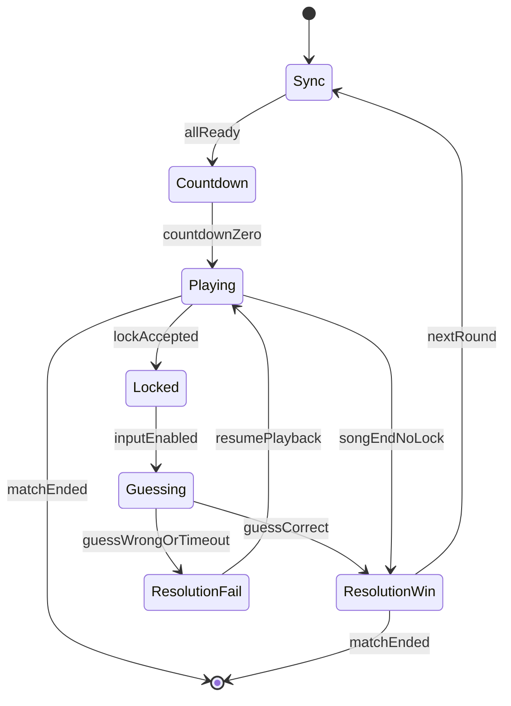

# Game Design Document: Multiplayer Music Trivia

## 1. Overview

A real-time, competitive music guessing game where gameplay is driven by a "Stop and Solve" mechanic. Each match uses random previews already stored in our database.

- **Audio source:** Previews stored in the product database (15 s).
- **Profile source:** Spotify OAuth (auth only; taste data not used for gameplay).
- **Target platforms:** Desktop web (keyboard + mouse) and mobile web (touch).
- **Document scope:** Full product spec (gameplay, UX, matchmaking, monetization, nonfunctional requirements) aligned to current codebase.

## 2. Product Goals

- Deliver a synchronized, low-latency guessing experience where every pause and resume is authoritative.
- Keep match setup fast: room creation in under 30 s and match start after all players ready.
- Encourage repeat play via short matches and clear scoring feedback.

## 3. Match Settings

- **Rounds per match:** 1 to 5 (set by room host).
- **Players per room:** 1 to 5. Matches may start with any number of players within this range.
- **Preview length:** 15 s fixed.
- **Guess window:** 10 s after lock (timeout triggers resume).
- **Cooldown on wrong guess:** 5 s.

## 4. Lobby and Matchmaking Flow

Room creation and pre-game flow follow the canonical lobby lifecycle.

### 4.1 Phases

- `lobby`
- `countdown`
- `in-game`
- `finished`

### 4.2 Client to Server Events

- `match:create` `{ expectedPlayers, displayName? }`
- `match:join` `{ matchId, displayName? }`
- `match:ready` `{}`
- `match:countdown_abort` `{ matchId, reason }` (host only)

### 4.3 Server to Client Events

- `match:created` `MatchStatePayload`
- `match:joined` `MatchStatePayload`
- `match:state` `MatchStatePayload`
- `match:countdown` `{ matchId, seconds }` (broadcast once)
- `match:countdown_aborted` `{ matchId, reason }`
- `match:error` `{ message }`

### 4.4 Lobby Rules (Closed Loop)

- **Start conditions:** All expected players are present and ready, or host triggers start.
- **Countdown:** Server emits `match:countdown { seconds: 5 }`. Clients run a local timer.
- **Abort conditions:** Ready drops, player leaves, host cancels, or timeout.
- **Transition to in-game:** Countdown reaches zero; server updates phase to `in-game`.

## 5. Round State Machine (In-Game)

Rounds run in a strict state machine within the `in-game` match phase. The Game Service is the authority for time and transitions.

### 5.1 Transition Table

| Event                  | From           | To             | Condition         | Server Actions                                             | Client Actions                           | Timeout              |
| ---------------------- | -------------- | -------------- | ----------------- | ---------------------------------------------------------- | ---------------------------------------- | -------------------- |
| `round:sync`           | -              | Sync           | New round started | Select random preview from DB, expose preview id for round | Request preview for round, preload audio | 15 s download window |
| `round:ready`          | Sync           | Countdown      | All clients ready | Broadcast `round:countdown`                                | Show countdown                           | 5 s                  |
| `round:countdown_zero` | Countdown      | Playing        | Timer hits 0      | Start authoritative timer                                  | Play audio at T=0                        | -                    |
| `round:lock_request`   | Playing        | Locked         | First lock wins   | Broadcast pause time                                       | Pause audio, show lock owner             | -                    |
| `round:lock_confirmed` | Locked         | Guessing       | Lock accepted     | Start 10 s guess timer                                     | Enable guess input for lock owner        | 10 s                 |
| `round:guess_submit`   | Guessing       | ResolutionWin  | Correct match     | Score, broadcast win                                       | Show reveal + score                      | 5 s interstitial     |
| `round:guess_timeout`  | Guessing       | ResolutionFail | Timer hits 0      | Apply penalty, resume                                      | Disable input, resume audio              | 5 s cooldown         |
| `round:guess_wrong`    | Guessing       | ResolutionFail | Incorrect guess   | Apply penalty, resume                                      | Disable input, resume audio              | 5 s cooldown         |
| `round:resume`         | ResolutionFail | Playing        | After cooldown    | Broadcast resume time                                      | Seek + play                              | -                    |
| `round:next`           | ResolutionWin  | Sync           | Rounds remaining  | Pick next track                                            | Preload next                             | -                    |
| `match:end`            | Any            | -              | Final round done  | Persist results                                            | Show final scoreboard                    | -                    |

## 6. Gameplay Details

### 6.1 Lock and Guess Flow

- First player to lock wins. All other lock attempts are rejected while locked.
- On lock acceptance, all clients pause at the authoritative timestamp.
- Guesser gets a 10 s input window; spectators see a locked UI state.
- Guess submission requires selecting a suggestion from the search dropdown.

### 6.2 Round Preview Fetch

- At the start of each round, the frontend requests the preview for that round using the round identifier.
- The server returns the preview URL (or signed URL) and the client preloads the audio before countdown.

### 6.3 Guess Resolution

- Correct: apply score, reveal track, show album art, then move to next round.
- Incorrect or timeout: apply penalty, enforce 5 s cooldown for the guesser, resume playback at the authoritative timestamp.

## 7. UX and Input

### 7.1 Desktop Web

- **Lock input:** Spacebar.
- **Search:** Text input with debounced suggestions; selection required to submit.
- **Feedback:** Immediate "requesting lock" state while waiting for server acceptance.

### 7.2 Mobile Web

- **Lock input:** Large "Guess" button with haptic feedback.
- **Search:** Same suggestion workflow as desktop.
- **Focus handling:** Input auto-focus on lock acceptance; keyboard dismiss on submit.

### 7.3 Spectator States

- Spectators see the lock owner, remaining guess time, and a read-only search field.

## 8. Scoring System

Points reward speed and accuracy.

| Metric       | Formula                                 | Example                           |
| ------------ | --------------------------------------- | --------------------------------- |
| Base score   | Fixed value for correct answer          | 100 pts                           |
| Speed bonus  | (TotalTime - ElapsedTime) \* Multiplier | Guess at 2 s: 13 \* 10 = +130 pts |
| Wrong guess  | Flat penalty                            | -50 pts                           |
| Max possible | Base + Max bonus                        | 250 pts                           |

## 9. Technical Architecture

### 9.1 Frontend

- **Build tool:** Vite.
- **Styling:** Tailwind CSS.
- **Audio:** HTML5 Audio for current implementation; move to Web Audio API if drift control becomes insufficient.
- **Round preview fetch:** Request the preview for the current round before countdown and preload it.
- **Search input:** `onChange` -> `debounce(300 ms)` -> GET `/api/search` -> render suggestions.

### 9.2 Backend Services

- **Nginx:** SSL termination, static asset serving, proxy for `/api` and socket traffic.
- **API Gateway:** Rate limit, token validation, search proxy with response normalization and cache.
- **Game Service:** Match state, lobby flow, socket rooms, audio sync events.
- **Auth Service:** Spotify OAuth, encrypted tokens.
- **Preview Service (or DB layer):** Provides random preview selection and round preview lookup.

### 9.3 Socket Events (Current Implementation)

- Lobby: `match:create`, `match:join`, `match:ready`, `match:state`, `match:created`, `match:joined`, `match:countdown`, `match:error`.
- Audio sync: `match:audio:toggle` (client) and `match:audio:sync` (server broadcast).

## 10. Edge Cases

- **Latency drift:** Server timestamp is the authority; clients seek on resume.
- **Empty search results:** Replace missing previews before the match starts.
- **Disconnection during lock:** Immediately resume for remaining players and clear lock owner.
